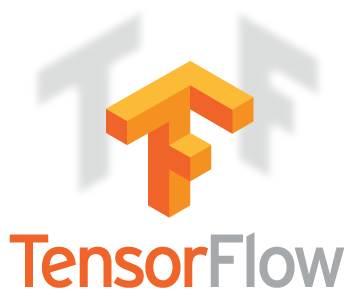

# Emerging Technology Project
## Overview for my Project
Overview for my project for Emerging Technology provide by our lecturer Ian McLoughlin:

In this project you will create a web application in Python to recognise digits in images. Users will be able to visit the web application through their browser, submit (or draw) an image containing a single digit, and the web application will respond with the digit contained in the image. You should use tensorflow and flask to do this. Note that accuracy of approximately 99% is considered excellent in recognising digits, so it is okay if your algorithm gets it wrong sometimes.

## [Contents](#contents)
[Introduction](#intro)  
[Design](#design)  
[Technology](#tech)  
[How to run Repository](#repo)  
[Conclusion](#con)   
[References](#ref) 

## Introduction <a name = "intro"></a>
Hello my name is Gerard Naughton. I am a 4th year student at GMIT studying Computer software and development. For my 4th year we were introduced to a new module Emerging Technology where we focused on python, jupyter notebook, optimization algorithms(gradient descent, linear regression), machine learning, neural networks and tensorflow. Through our module we were given problem sheets which eventually prepared us for our 40% Project. 

Following the overview above, I planned to train a neural network using Keras and tensorflow to create a model which i could then use to predict what hand-written numbers were written ranging from 0 to 9.

## Project User Design <a name = "design"></a>
User Design was simple. I would create single page web app using flask. I would have a single HTML page called index.html which would display a canvas on the left side of the page allowing the user to draw a number. Underneath this their would be 2 buttons Predict and clear. Predict would submit the image and below eventually my application would predict which number was drawn. Clear would clear the canvas to try again. 
On the right I will have  Profile of myself saying about me and my application. Also providing a link to my github repository for this project.

<p align="center"></p>

I use a ajax call to call my predict function and return a prediction from my keras/tensorflow model.
I use bootstrap and css to style my application.

[Top](#contents)
## Technology <a name = "tech"></a>  

The 3 main technologies used for my project were Flask, Tensorflow and Keras. Here I explain a little on each technology:

<p align="center"></p>

### <p align="center">Python Flask</p>

Flask is a micro web framework written in python and based on the werkzeug toolkit and jinja2 template engine. Flasks allows users to create web applications simply and fast. Flask has become extremely popular with python users and as of mid 2016 is the most popular python web development framework on github. For further info visit [Flask](http://flask.pocoo.org/).

<p align="center"></p>

### <p align="center">Tensor Flow</p>

Tensorflow is a open source software library. it provides Numerical computation using data flow graphs. Tensorflow was origionally developed by the Google Brain Team within Google's Machine Intelligence research organization. Here they used Tensorflow to conduct machine learning and deep nueral network research. 

How it works: Nodes in the graph represent mathematical operations, while the graph edges represent the multidimensional data arrays (tensors) communicated between them. Adapted from [Tensorflow.org](https://www.tensorflow.org/). Providing inputs and expected output to these nueral networks allows us to train them. Through configuration of the network we create greater efficiency and more accurate results. To understand more on tensorflow click [Tensorflow.org](https://www.tensorflow.org/).

<p align="center"></p>

### <p align="center">Keras</p>

Keras is a high-level neural networks API, written  in Python and capable of running on top of TensorFlow. Developed to enable fast experimentation. 
There philosphy is "Being able to go from idea to result with the least possible delay is key to doing good research".

Keras Characteristics:

* Allows for easy and fast prototyping 
* Supports both convolutional networks and recurrent networks, as well as combinations of the two.
* Runs seamlessly on CPU and GPU.
* Guiding principles include:
    * User friendliness
    * Modularity
    * Easy extensibility
    * Work with Python

[Top](#contents)
## How to run Repository <a name = "repo"></a>

What packages are needed before downloading or cloning my repository?

1. Firstly download anaconda in order to code in python. You can download anaconda through this link and following their instructions: [Anaconda.com](https://www.anaconda.com/download/) Anaconda is a open source for distribution of python and packages.

2. When you downloaded anaconda you will have recieved a anaconda terminal called anaconda prompt. if you search on your computer it should pop up.

3. Through the Anacomda terminal you will install Tensorflow. Click on the following [TensorflowInstall](https://www.tensorflow.org/install/) and follow their instructions. 

4. Download my repository to your computer using clone or download methods.

5. After downloading the repository, navigate to the repository. In here activate Tensorflow with the command:
```
activate tensorflow 
```
6. You will now have install the following packages for your enviroment:

    * Install scipy with anaconda this command:

    ```
     conda install -c anaconda scipy 
    ```
    * Install numpy with anaconda this command:

    ```
     conda install -c anaconda numpy
    ```
    * Install regex with anaconda this command:

    ```
     conda install -c conda-forge regex
    ```
    * Install flask with anaconda this command:

    ```
     conda install -c anaconda flask 
    ```
    * Install base64 with anaconda this command:

    ```
     conda install -c bioconda r-base64  
    ```
    * Install Keras with anaconda this command:

    ```
     conda install -c conda-forge keras  
    ```
7. Once your enviroment is set up you will be able to run the code. Simply type the command while Tensorflow is still activated:
    ```
     python app.py
    ```
8. This will provide you with a url which you can simply paste into your browser and use the web application.

9. You can also run the training application. This is where we create our model and train it against the MNIST data set. It is here we create our model for our application. Depending on your computer this may take 30min to 90 min to run as there is 70000 images to process. To run navigate into the model folder in your repository and type the command while Tensorflow is still activated:
    ```
     python train.py
    ```

[Top](#contents)
## Conclusion <a name = "con"></a>

[Top](#contents)
## References <a name = "ref"></a>

[Top](#contents)
